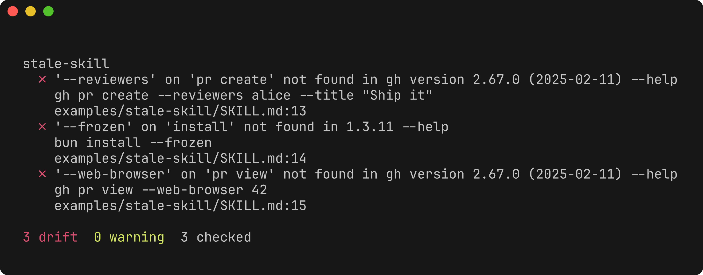
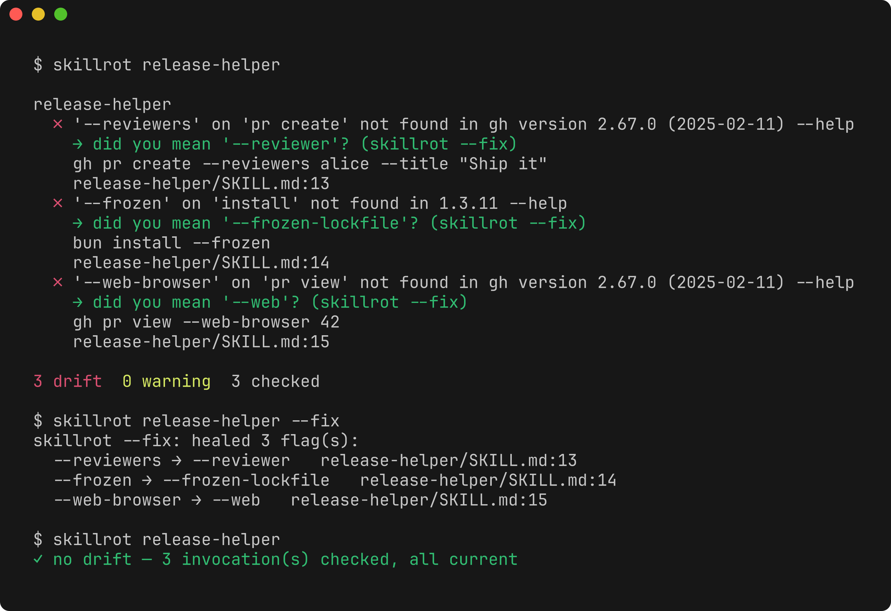

<div align="center">


# skillrot

**your skills rot when the tools they call move on**

<a href="https://github.com/mishanefedov/skillrot/stargazers"></a>
<a href="https://github.com/mishanefedov/skillrot/commits/main"></a>
<a href="LICENSE"></a>


</div>

A linter for agent skills. A skill that shells out to `codex`, `gh`, `docker`,
`supabase`, `bun`, ... is a time bomb: the tool ships a new version, renames a
flag or drops a subcommand, and the skill keeps confidently emitting the old
command. Nobody gets an error that says *"this skill is out of date"* — the
agent just runs a dead command and fails mid-task.

`skillrot` reads each skill's bash, extracts the `command subcommand --flags` it
actually uses, and checks them against the installed CLI's own `--help`.

```text
$ skillrot ~/.claude/skills

deploy-app
  ✗ '--legacy-config' on 'compose up' not found in Docker version 27.4.0 --help
    docker compose up --legacy-config -d
    deploy-app/SKILL.md:64

1 drift  0 warning  41 checked     (exit 1)
```

Real run, reproducible with `gh` + `bun` installed (`skillrot examples/stale-skill`):

<div align="center"></div>

### Why

I was using a skill that wraps the Codex CLI. Codex shipped a release that
changed `codex review` so `--base` can no longer be combined with a prompt. The
skill kept generating the old form and failed silently, mid-task. That's a whole
class of bug — every skill that wraps a CLI is exposed — and nothing was checking
for it. (That specific *constraint* case is the [v2 target](#scope); v1 catches
the far more common removed/renamed flags and dead subcommands.)

## Try it (no install)

```bash
npx skillrot ~/.claude/skills        # or: bunx skillrot ~/.claude/skills
```

Zero install — it runs straight off npm with just Node (or Bun). Point it at any
skills folder and see if anything's rotten before you decide to keep it around.

## Install

skillrot is both a **skill** (the audit logic) and a small, dependency-free
**CLI** (the engine). The CLI is a single bundle that runs on plain Node — no
Bun required to use it.

**Homebrew:**

```bash
brew install mishanefedov/tap/skillrot
```

**npm (global command):**

```bash
npm install -g skillrot
```

**Any agent — one line** (downloads a prebuilt, self-contained binary — no
Node/Bun needed — and registers the skill with every coding agent on the
machine):

```bash
curl -fsSL https://raw.githubusercontent.com/mishanefedov/skillrot/main/install.sh | bash
```

**Claude Code plugin** (no clone):

```text
/plugin marketplace add mishanefedov/skillrot
/plugin install skillrot@skillrot
/reload-plugins
```

**Skill-only** via the cross-agent skills installer:

```bash
npx skills add mishanefedov/skillrot --skill skillrot --global --all
```

Agents can self-install by reading [`INSTALL_FOR_AGENTS.md`](INSTALL_FOR_AGENTS.md).

### Works with

Any agent that loads `SKILL.md`-format skills: **Claude Code, Codex, Cursor,
opencode, Factory, Kiro** (the installer symlinks into each one it finds, plus
the shared `~/.agents/skills`). The CLI is agent-agnostic — run it from anything,
including CI.

## Usage

```bash
skillrot <skills-dir>                 # text report; exit 1 if any drift
skillrot <skills-dir> --fix           # self-heal: rewrite drifted flags in place
skillrot <skills-dir> --cost          # context-cost audit (tokens per session)
skillrot <skills-dir> --json          # machine-readable
skillrot <skills-dir> --tools codex,gh,docker   # only check these CLIs
skillrot ./skills/one-skill           # a single skill (dir with SKILL.md)
```

### Self-healing

When a drifted flag has a confident match in the CLI's current `--help` (a
rename, plural, or extension — `--reviewers`→`--reviewer`, `--frozen`→
`--frozen-lockfile`), skillrot suggests it inline and `--fix` rewrites the skill
in place. It only rewrites high-confidence matches, never a guess.

<div align="center"></div>

### Context cost (`--cost`)

Every installed skill's name + description is loaded into **every session** so
the agent knows the skill exists — the body only loads when the skill fires. So
a big skill folder quietly taxes your context window before you type anything.
`--cost` measures that always-on tax, ranks the heaviest descriptions, and flags
the ones worth trimming.

```text
$ skillrot ~/.claude/skills --cost
67 skills · ≈7.1k tokens injected into every session before you type anything
(every skill's name + description is always loaded; bodies ≈657k tok load only when a skill fires)

Heaviest always-on descriptions:
  ≈196 tok   brief        ~/.claude/skills/brief/SKILL.md
  ≈195 tok   plan-tune    ~/.claude/skills/plan-tune/SKILL.md
  ...
```

It counts one SKILL.md per top-level skill (what an agent actually loads), not
mirror copies. Token counts are a ~4-chars/token estimate (shown with `≈`).

It scans `SKILL.md` bash fences and `*.sh` scripts.

## What it catches (v1)

| Drift | Level |
|---|---|
| A long flag the installed CLI no longer accepts (`--gone`) | error |
| A subcommand that no longer exists | error |
| A missing short flag (`-z`) | warning (noisier, lower confidence) |
| A CLI the skill calls that isn't installed | warning |
| A `--help` that couldn't be read | warning |

Conservative on purpose: only high-confidence drift is an error. A linter that
cries wolf gets uninstalled.

## How it works

1. **Extract** — a quote-aware tokenizer pulls `command [subcommand…] --flags`
   from each skill's bash (unwrapping `sudo`/`env`/`timeout`/`bunx`/...). It
   targets an allowlist of real CLIs and captures up to two subcommand tokens
   (`gh pr view`), so flags are checked at the right level. Not a full shell
   parser — uncertain parses lean toward warnings.
2. **Introspect** — runs `<tool> [subpath] --help` and `--version`, walking the
   subcommand path deepest-first so `gh pr view --json` is checked against
   `gh pr view --help`, not `gh --help`.
3. **Analyze** — token-boundary flag matching (so `-c` doesn't match inside
   `--config`).
4. **Report** — grouped by skill with `file:line`; exit 1 on any error.

## Scope

**v1 catches:** removed/renamed flags, dead subcommands, uninstalled tools —
**self-heals** confident flag renames with `--fix`, and audits your skills'
always-on **context cost** with `--cost`.

**Roadmap (v2):**

- **Semantic constraints** — "flag A can't be combined with flag B", required
  values, mutually exclusive modes (the Codex `--base` case). Reliable detection
  needs **sandboxed replay**: run the real arg shape with sentinel values inside
  a disposable, network-less container and read the argument-parse error.
- **Version stamping** — record the CLI versions a skill was validated against
  and flag drift since.
- **Native packaging per agent** (Codex/Cursor marketplaces). The CLI itself
  already ships with zero prerequisites — `npx skillrot`, `npm install -g`,
  `brew install`, or a prebuilt binary.

## Prior art

[`cli-tools-skill`](https://github.com/netresearch/cli-tools-skill) makes sure
the tools a skill needs are *installed*. skillrot is the other half: it checks
they're *used correctly for the version installed*. Presence vs. correctness.

## License

MIT
